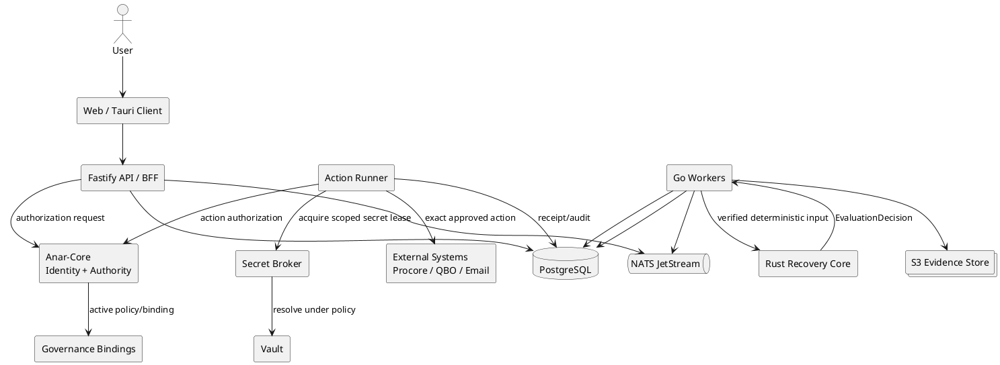
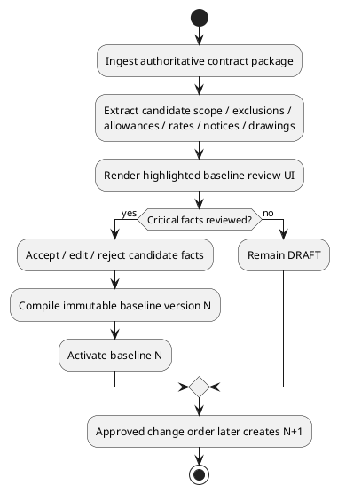
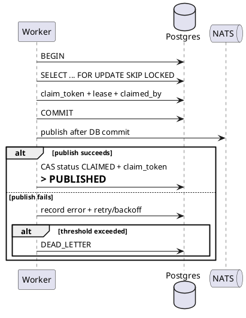
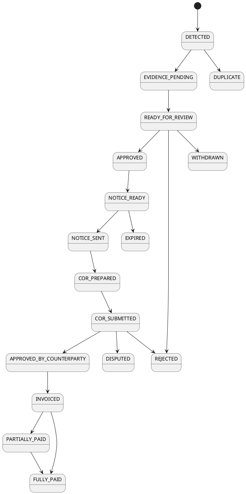
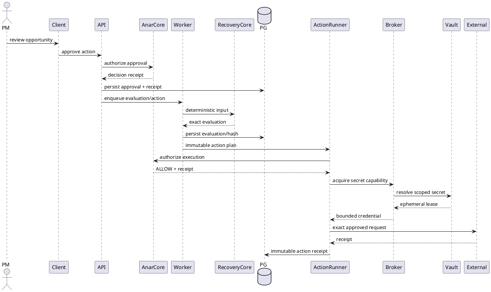

# SPEC-1.6-AnarchI-Tech-Recoveries

> **Status:** FROZEN / LOCKED  
> **Version:** 1.6  
> **Product:** AnarchI Tech Recoveries / Financial Rescue  
> **Initial vertical:** Electrical subcontractors  
> **Parent architecture:** AnarchI Systems Stack  
> **Governance authority:** AnarchI Governance + Anar-Core  
> **Primary architectural invariant:** AI may extract and suggest; deterministic services decide, calculate, attribute, authorize, and act.  
> **Primary product promise:** **We find money you earned before it disappears.**

---

## Background

AnarchI Tech Recoveries is the flagship financial-recovery product of AnarchI Technologies. Its purpose is to identify deterministic financial leakage in business records, prove the opportunity using evidence and explicit rules, calculate the recoverable amount deterministically, prepare the action required to recover the money, track the downstream cash event, and reconcile attributable recovery.

The initial product wedge is construction, beginning with electrical subcontractors. The MVP detects revenue that may have been earned but never invoiced because scope changed in drawings, RFIs, directives, T&M records, field activity, labor, material, and equipment records without being converted into a recognized change order.

The product is not intended to become another construction ERP, project-management platform, chatbot, or opaque AI assistant. Existing construction applications generally manage changes after people identify them. Recoveries is designed to discover unidentified money before it disappears.

The system is deliberately epistemic and deterministic. It should feel intelligent because it maintains provenance, compares state, applies explicit rules, explains conclusions, and refuses to overstate what it knows. LLMs and extraction models may assist in document parsing and candidate-fact generation, but they are not the authority for entitlement, pricing, deadlines, attribution, billing, authorization, or execution.

The product lifecycle is:

```text
DISCOVER → PROVE → PRICE → SUBMIT → TRACK → COLLECT → RECONCILE
```

The first release intentionally stops short of autonomous negotiation, dispute resolution, collections, or legal representation.

### Parent AnarchI architecture

Recoveries is not a standalone governance island. It inherits the AnarchI institutional stack:

```text
ANARCHI SYSTEMS STACK
│
├── Signal
├── State
├── Rules
├── Execution
├── Audit
├── AI Escalation
└── Presentation
        │
        ├──────── Institutional Control Plane ────────┐
        │                                             │
        ▼                                             ▼
  Governance Canon                              Anar-Core
  law / provenance                         identity / current authority
        │                                             │
        └──────────────┬──────────────────────────────┘
                       ▼
                     Broker
             bounded executable capability
                       │
                       ▼
                     Vault
             secret-resolution authority
                       │
            ┌──────────┴──────────┐
            ▼                     ▼
         Products            Infrastructure
            │
      ┌─────┴──────┐
      ▼            ▼
   AdForge      Recoveries
                    │
                    ▼
             Recovery Core
          deterministic money truth
                    │
                    ▼
              Action Runner
                    │
                    ▼
            External Systems
```

Kiln remains separate from runtime authority. It exists as a destructive-testing and proof environment:

```text
Source
  │
  ▼
Kiln specimen
  │
  ├─ mutation
  ├─ fracture proof
  ├─ survivor evidence
  └─ restoration proof
        │
        ▼
Human / governance adjudication
        │
        ▼
Separate promotion authority
```

Kiln may prove that something broke or survived. It may not grant repair, promotion, commit, push, publication, deployment, or authority.

### Governance maturity

The governance repository already establishes a strong canon pipeline:

```text
Canonical Governance Corpus
        │
        ▼
Rule Extraction
        │
        ▼
Refinery
        │
        ▼
Human Adjudication
        │
        ▼
Canonical Machine Rules
        │
        ▼
Authority Classification
        │
        ▼
Enforcement Binding
        │
        ▼
Executable Proof
        │
        ▼
Governance Readiness
        │
        ▼
Anar-Core Enforcement
```

The existing governance posture correctly refuses to claim executable enforcement before proof exists. The frozen design preserves that behavior.

The critical relationship between institutional governance and product runtime is:

```text
Anar-Core:
"May this action occur?"

Recovery Core:
"What is the deterministic financial result?"

Vault / Secret Broker:
"May this capability resolve this secret?"

Action Runner:
"Execute exactly the approved immutable action."
```

No service is allowed to collapse these responsibilities.

### Commercial model

Recoveries earns revenue through a recurring SaaS subscription plus a success fee on attributable cash actually received.

Launch commercial assumptions:

| Item | Frozen launch position |
|---|---|
| SaaS hypothesis | approximately $499/month |
| Active-project success fee | 15% of attributable cash actually collected |
| Historical-rescue success fee | 20% of attributable cash actually collected |
| Verification-only recovery | $0 incremental success fee |
| Prior-recognized value | excluded from attributable recovery except uplift |
| Partial payment | fee accrues only against attributable cash actually received |
| Success-fee dispute window | 30 days after attribution/reconciliation statement |

A sliding fee scale may be supported internally later, but is not part of the launch-facing pricing contract.

### Visual product thesis

The frozen product presentation is:

> **institutional financial software + forensic evidence room + AnarchI precision**

The product must not look like cyberpunk, construction-orange ERP, crypto analytics software, or generic AI SaaS.

The primary visual system is **Evidence Ledger**. Its dark counterpart is **Blacksite**, but the primary app look is the light Evidence Ledger profile.

The UI should communicate:

> **This system found $18,420. Here is exactly why.**

not:

> "Ask AI what happened."

The selected logo direction is a fresh Recoveries mark derived from the Recovery Gate concept with sharper Delta-Shard geometry. Rejected logo concepts are explicitly excluded from this specification.

---

## Requirements

### Must

1. Detect likely out-of-scope work by comparing approved baseline scope against live project records.
2. Launch with electrical subcontractors as the first supported vertical.
3. Ingest contracts, scope documents, estimates, drawings, RFIs, directives, daily logs, T&M tickets, email, labor, material, and equipment records.
4. Produce evidence-backed recovery opportunities with:
   - triggering event,
   - baseline reference,
   - changed condition,
   - supporting evidence,
   - estimated recoverable value,
   - notice rule and deadline,
   - recommended next action.
5. Never fabricate scope, contract terms, pricing, evidence, dates, or authority.
6. Use human approval by default.
7. Support explicitly customer-authorized automation only through policy.
8. Produce a full immutable audit trail.
9. Separate entitlement, cost, submission price, attribution, and cash collection.
10. Calculate proposed change-order value from verified labor, material, equipment, subcontractor, burden, tax, and markup rules.
11. Support historical ingestion and backward scans.
12. Maintain exact calculation traceability.
13. Keep deterministic money decisions server-authoritative.
14. Keep AI extraction non-authoritative until verification.
15. Enforce tenant isolation from day one.
16. Preserve immutable evidence and baseline history.
17. Retain exact version provenance for rules, pricing, models, evidence, policy, and evaluation.
18. Provide a Windows installed client at launch while keeping the web client available.
19. Support iOS/iPadOS after Windows, then Android.
20. Preserve one shared design-token/component system across web and installed clients.
21. Fail closed on missing required pricing, authority, policy, evidence, tax, currency, or deadline data.
22. Treat Postgres as business-state authority, S3-compatible storage as binary-evidence authority, and NATS as transport only.
23. Use Anar-Core for institutional identity/authority decisions rather than local ad-hoc authorization.
24. Use Secret Brokers and Vault for secret-resolution boundaries.
25. Emit attributable decision receipts for privileged runtime decisions.
26. Preserve customer-data ownership and customer-controlled export/deletion semantics.
27. Keep governance permanence separate from customer-data retention.
28. Maintain formal legal, privacy, security, incident, retention, and service-support policies.
29. Operate under Kansas-governed U.S. launch contracts using signed MSA + Order Form.
30. Preserve the exact deterministic invariant:

> **Same baseline + evidence versions + rule version + pricing version + evaluation time = same result.**

### Should

1. Integrate with existing contractor systems rather than replace them.
2. Rank opportunities by:
   - value,
   - entitlement strength,
   - evidence completeness,
   - pricing completeness,
   - deadline risk.
3. Detect missing evidence explicitly.
4. Draft notices and change-order packages.
5. Track submitted, approved, rejected, disputed, invoiced, written-off, and paid outcomes.
6. Support Procore, QuickBooks Online, email, and file-upload connectors.
7. Support dry-run automation simulation.
8. Support deadline alerts.
9. Support historical rescue analysis.
10. Support recurring-cause benchmarks later.
11. Provide immutable ledger and proof-chain views.
12. Provide accessible linear alternatives to graph visualizations.
13. Support limited encrypted offline cache for installed clients.
14. Revalidate queued offline actions before execution.
15. Use native notifications while keeping confidential detail off lock screens by default.
16. Publish a subprocessor list and version it.
17. Provide severity-based support and incident-response targets.
18. Support production migration from founder/dev infrastructure to dedicated server infrastructure without domain redesign.

### Could

1. Auto-submit notices in explicitly safe, policy-authorized workflows.
2. Add Microsoft Store distribution later.
3. Add enterprise MSI deployment later.
4. Add biometric/device-auth confirmation for sensitive client actions.
5. Add second-site or cloud failover after production scale justifies it.
6. Add adjacent construction verticals:
   - mechanical,
   - plumbing.
7. Add future recovery domains:
   - B2B invoice payment resolution,
   - workers’ comp audit defense,
   - commercial utility bill recovery,
   - bookkeeping evidence automation,
   - trucking detention/accessorial recovery,
   - freight,
   - receivables,
   - margin leakage,
   - collections.
8. Add Margin Rescue using actual contractor cost/charge data and market benchmarks.
9. Add bank/financial-institution servicing only after security, compliance, governance, and licensing maturity.

### Won’t — MVP

1. Autonomous negotiation.
2. Legal representation.
3. Final legal contract interpretation without human review.
4. Collections.
5. Dispute resolution.
6. Delay claims.
7. Disruption claims.
8. Schedule-impact claims.
9. Retainage recovery.
10. Full estimating.
11. Full project management.
12. Accounting-system replacement.
13. Opaque combined AI confidence.
14. AI-determined entitlement.
15. AI-calculated financial totals.
16. Client-authoritative recovery evaluation.
17. Permanent retention of customer data by default.
18. Distribution of Vault as an embedded client-side secret server.
19. Any local service authority that contradicts Anar-Core governance.

### First detection classes

The MVP detection scope is frozen to:

1. Drawing quantity deltas.
2. RFI/directive scope changes.
3. T&M work not converted to recognized change order.
4. Labor/material/equipment records attached to those events.

### Evidence hierarchy

Higher-quality evidence may override lower-quality evidence, but contradictions must be retained.

| Rank | Evidence class |
|---:|---|
| 1 | Signed contract / executed change order |
| 2 | Approved scope + IFC drawings |
| 3 | Formal directives / RFIs / bulletins |
| 4 | Signed T&M / daily logs |
| 5 | Accounting / payroll / purchase records |
| 6 | Email / messages / field notes |
| 7 | AI-extracted or inferred candidate facts |

### Confidence semantics

No opaque combined confidence score is permitted.

The UI and API expose separate dimensions:

| Dimension | Meaning |
|---|---|
| Entitlement strength | degree to which contractual/authorized evidence supports the recovery |
| Evidence completeness | required evidence present vs missing |
| Pricing completeness | required pricing inputs present and validated |
| Deadline risk | risk of losing or weakening recovery due to notice timing |
| AI extraction confidence | candidate-fact extraction confidence only; never a money/entitlement confidence |

### Frozen governance invariants

1. Canonical text is not executable authority until a reviewed enforcement binding exists.
2. No application service may create local authority that contradicts Anar-Core governance.
3. Every privileged runtime decision must emit a decision receipt containing identity, authority class, policy version, binding, scope, result, and provenance.
4. Governance readiness may transition to READY only when required active bindings have executable proof and release provenance.
5. Canonical metadata must not contradict document-body status declarations.
6. Status/canonicality belongs in one authoritative metadata location.
7. Application-visible secret references are not authorization mechanisms.
8. Possession of a secret reference does not imply permission to resolve it.
9. Secret resolution requires authenticated identity, authority, organization, purpose, and policy.
10. No service is considered secure merely because it sits behind Cloudflare.

---

## Method

### 1. System architecture



### 2. Technology boundaries

| Layer | Frozen technology / responsibility |
|---|---|
| Web UI | Next.js / React |
| Installed client | Tauri 2 + shared React/design system |
| API/BFF | Fastify + TypeScript |
| Ingestion/connectors | Go |
| Event/outbox workers | Go |
| Deterministic recovery kernel | Rust |
| Document/ML ecosystem | Python only where useful |
| System of record | PostgreSQL |
| Binary evidence | S3-compatible immutable evidence store |
| Work/event transport | NATS JetStream |
| Identity provider | self-hosted ZITADEL OIDC |
| Institutional authority | Anar-Core |
| Secret resolution | Secret Broker + Vault |
| Ingress | Cloudflare / cloudflared + reverse proxy |
| Observability | OpenTelemetry + Prometheus/Grafana; Loki optional |
| Initial orchestration | Docker Compose |
| Production evolution | dedicated servers; later k3s/Kubernetes only if justified |

### 3. Repository topology

```text
anarchi-recoveries/
├─ apps/
│  ├─ web/
│  ├─ api/
│  └─ client/
│     ├─ src/
│     ├─ src-tauri/
│     │  ├─ Cargo.toml
│     │  ├─ tauri.conf.json
│     │  ├─ capabilities/
│     │  └─ src/
│     ├─ android/
│     └─ ios/
├─ services/
│  ├─ outbox-publisher/
│  ├─ ingestion/
│  ├─ normalization/
│  ├─ extraction/
│  ├─ action-runner/
│  └─ reconciliation/
├─ crates/
│  ├─ recovery-model/
│  ├─ recovery-core/
│  ├─ pricing/
│  ├─ policy/
│  └─ construction-electrical/
├─ packages/
│  ├─ contracts/
│  ├─ db/
│  ├─ connector-sdk/
│  ├─ authz/
│  ├─ observability/
│  ├─ ui/
│  ├─ design-tokens/
│  └─ api-client/
├─ connectors/
│  ├─ procore/
│  ├─ quickbooks-online/
│  ├─ email/
│  └─ file-upload/
├─ schemas/
│  ├─ canonical/
│  ├─ events/
│  ├─ rules/
│  └─ extraction/
├─ infra/
│  ├─ compose/
│  ├─ caddy/
│  ├─ postgres/
│  ├─ object-store/
│  ├─ nats/
│  ├─ backups/
│  ├─ monitoring/
│  └─ zitadel/
├─ fixtures/
│  ├─ projects/
│  ├─ contracts/
│  ├─ drawings/
│  ├─ rfis/
│  └─ expected-evaluations/
├─ docs/
│  ├─ architecture/
│  ├─ ADR/
│  ├─ rules/
│  ├─ integrations/
│  └─ runbooks/
└─ tools/
   ├─ replay/
   ├─ seed/
   ├─ fixture-generator/
   └─ migration-check/
```

### 4. Deterministic / AI boundary

Canonical processing path:

```text
1. Normalize source records
2. Detect/extract factual deltas
3. Map delta to baseline
4. Apply entitlement rules
5. Verify evidence threshold
6. Calculate price
7. Check notice deadline
8. Deduplicate
9. Produce finding
10. Review / authorize
11. Execute
12. Reconcile
13. Accrue fee
```

Authority by stage:

| Stage | AI allowed? | Deterministic/human authority? |
|---|---:|---:|
| OCR/document segmentation | yes | no financial authority |
| Candidate fact extraction | yes | candidate only |
| Suggested scope mapping | yes | deterministic/human verification |
| Entitlement | no | deterministic |
| Evidence threshold | no | deterministic |
| Price | no | deterministic |
| Tax | no | deterministic |
| Deadline | no | deterministic |
| Dedup finalization | similarity suggestion only | deterministic/human |
| Attribution | no | deterministic |
| Billing | no | deterministic |
| Action authorization | no | Anar-Core/policy |
| Action execution | no | immutable action plan |

### 5. Atomic fact model

Every candidate or verified fact must contain:

```text
fact_id
organization_id
project_id
fact_type
subject
value
unit
currency? 
source_evidence_id
source_location
extraction_method
model_or_parser_version
candidate_confidence?
verification_status
verified_by?
verified_at?
supersedes_fact_id?
created_at
```

No `serde_json::Value` is permitted inside the deterministic Rust core for known fact types. Use typed enums.

### 6. Baseline construction



Rules:

- baseline versions are immutable,
- exactly one ACTIVE baseline per project,
- approved changes create new versions,
- unchanged logical scope items are not cloned unnecessarily,
- scope-item validity ranges may not overlap.

### 7. Data model

Core relational entities:

```text
organizations
users
external_identities
organization_memberships
projects
evidence
facts
contract_baselines
scope_items
scope_item_versions
project_events
recovery_opportunities
opportunity_evidence
pricing_calculations
pricing_lines
fx_conversions
approval_policies
payments
recovery_payment_allocations
success_fee_accruals
audit_events
consumer_inbox
transactional_outbox
secret_references
governance_decision_receipts
action_plans
action_receipts
```

#### Tenant identity model

```sql
external_identities (
  id uuid primary key,
  external_iss text not null,
  external_sub text not null,
  unique(external_iss, external_sub)
);

organization_memberships (
  organization_id uuid not null,
  user_id uuid not null,
  external_identity_id uuid not null,
  role text not null,
  status text not null,
  primary key (organization_id, user_id)
);
```

The external IdP organization identifier is never database tenant authority.

At transaction start:

```sql
SELECT set_config(
  'anarchi.current_organization_id',
  $internal_org_uuid::text,
  true
);

SELECT set_config(
  'anarchi.current_user_id',
  $internal_user_uuid::text,
  true
);
```

RLS requirements:

- application runtime role is not table owner,
- no `BYPASSRLS`,
- `ENABLE ROW LEVEL SECURITY`,
- `FORCE ROW LEVEL SECURITY`,
- explicit `USING`,
- explicit `WITH CHECK`,
- tenant-aware composite foreign keys,
- migration/table-owner role separate from runtime role.

### 8. Evidence storage

S3 object key:

```text
/org/{organization_id}/project/{project_id}/evidence/{evidence_id}/{sha256}/{original_filename}
```

Filename is never identity.

Evidence row includes:

```text
organization_id
project_id
evidence_id
source_system
external_id
source_version
source_observed_at
object_uri
mime_type
size_bytes
sha256
previous_version_id
metadata
created_at
```

The storage abstraction must pass compatibility tests for:

- PUT/GET,
- HEAD,
- multipart,
- presigned PUT,
- presigned GET,
- range reads,
- metadata,
- versioning,
- conditional requests,
- retention/object-lock behavior where enabled.

Object locking is policy-driven by evidence class and is not globally irreversible.

### 9. Scope history

Stable logical identities live in `scope_items`.

Historical state lives in immutable `scope_item_versions`.

Conceptual schema:

```sql
scope_item_versions (
  organization_id uuid not null,
  scope_item_id uuid not null,
  valid_from_baseline_version integer not null,
  valid_to_baseline_version integer,
  quantity numeric,
  unit text,
  description text,
  source_evidence_id uuid not null,
  ...
);
```

Validity ranges must not overlap. Use a real exclusion constraint such as `int4range` + `btree_gist`.

Exactly one active baseline per project must be guaranteed with a partial unique index.

### 10. Event architecture

Frozen subjects:

```text
ingest.received.v1
evidence.persisted.v1
evidence.normalize.requested.v1
evidence.normalized.v1
extraction.requested.v1
extraction.completed.v1
fact.candidate.created.v1
fact.verified.v1
baseline.activated.v1
recovery.evaluate.requested.v1
recovery.evaluated.v1
opportunity.updated.v1
action.requested.v1
action.authorized.v1
action.executed.v1
payment.observed.v1
attribution.reconciled.v1
billing.success_fee.accrued.v1
```

Canonical envelope:

```json
{
  "schema_version": "1.0",
  "event_id": "uuid",
  "event_type": "fact.verified",
  "organization_id": "uuid",
  "project_id": "uuid",
  "aggregate_id": "uuid",
  "occurred_at": "RFC3339",
  "causation_id": "uuid|null",
  "correlation_id": "uuid",
  "idempotency_key": "string",
  "payload": {}
}
```

NATS dedupe is transport protection only.

Durability requires:

- durable consumer inbox,
- transactional outbox,
- business mutation + inbox insert in one DB transaction,
- outbox publish only after commit.

### 11. Outbox publisher

Implementation:

- Go,
- `pgx/v5`,
- `nats.go/jetstream`,
- dedicated publisher,
- no third-party outbox framework initially.

Correctness model:



Rules:

- never hold claim transaction open during broker I/O,
- increment publish-attempt count only when an actual broker publish attempt occurs,
- compare-and-set success/failure by row id + status + claim token,
- stale leases cannot overwrite current owner,
- explicit dead-letter state,
- dead-letter alert/metric/audit,
- multi-worker safe.

### 12. Detection rule example

`DRAWING_QUANTITY_INCREASE_V1`

Conditions:

```text
observed_revision > baseline_revision
item_mapping_verified == true
quantity_delta > 0
allowance_remaining <= 0
existing_change_order_coverage == false
required_baseline_evidence == present
required_revised_evidence == present
```

Promotion:

- if direction/work performed is not verified → POTENTIAL_CHANGE,
- if authorized RFI/directive or performed work is verified → eligible for stronger state.

Example:

```text
E-203 Rev2: 42 Type-A receptacles
E-203 Rev3: 48 Type-A receptacles
Baseline: Rev2
RFI-227: directs EC to Rev3
Executed CO coverage: none
Delta: +6
```

The engine must output:

```text
passed_conditions
failed_conditions
missing_conditions
facts_used
rule_version
decision
```

### 13. Deduplication

Deterministic deduplication key includes:

```text
project
scope item
location
change type
origin revision/directive
time bucket
```

Similarity may suggest a merge. Similarity may not finalize one.

### 14. Entitlement / cost / price separation

The product never conflates:

1. entitlement,
2. measured incremental cost,
3. contractual submission price.

A cost increase is not automatically represented as money owed.

### 15. Rust recovery core

Conceptual interface:

```rust
evaluate_recovery(
    baseline,
    verified_facts,
    domain_rules,
    pricing_rules,
    notice_rules,
    attribution_state,
    evaluation_time
) -> Result<EvaluationDecision, EngineError>
```

`evaluation_time` is explicit.

The core has:

- no network,
- no database,
- no LLM,
- no implicit clock,
- no randomness,
- no side effects.

Valid non-opportunity results are domain decisions, not errors:

```rust
enum EvaluationDecision {
    Opportunity(EvaluationOutput),
    NoOpportunity(NoOpportunityReason),
}
```

### 16. Decimal and money rules

No IEEE-754 floating-point values cross deterministic financial boundaries.

JSON financial values are strings:

```json
{
  "amount": "4938.23",
  "markup_percent": "15.00"
}
```

Rust decimal fields serialize as strings.

Missing required financial rules fail closed.

Examples of hard failures:

```text
MissingLaborRate
MissingMarkupRule
MissingTaxRule
UnsupportedTaxRule
MissingRoundingRule
CurrencyMismatch
MissingFxConversion
```

Rounding is versioned:

```text
money scale
rounding mode
labor rounding timing
markup timing
tax timing
```

Taxability is explicit by class.

### 17. Golden pricing fixture

Frozen arithmetic:

| Line | Calculation | Amount |
|---|---:|---:|
| Journeyman labor | 14.5 × 92.50 | $1,341.25 |
| Apprentice labor | 9 × 61.25 | $551.25 |
| Material | fixed verified cost | $2,194.11 |
| Equipment | fixed verified cost | $475.00 |
| Raw subtotal | sum | $4,561.61 |
| Material markup | 15% × 2,194.11 | $329.12 |
| Equipment markup | 10% × 475.00 | $47.50 |
| Total markup | sum | $376.62 |
| Tax | explicit rule | $0.00 |
| **Total** | deterministic total | **$4,938.23** |

The golden test asserts full semantic equality before hashing.

Canonical evaluation hash:

```text
SHA256(
  canonical JSON of evaluation payload excluding its own hash
)
```

Canonicalization must be version-pinned and RFC 8785 / JCS compatible.

### 18. Currency

Every financial record carries explicit ISO currency.

```text
pricing_calculations.currency
pricing_lines.currency
payments.currency
allocations.currency
```

Cross-currency conversion requires a versioned `fx_conversions` record containing:

```text
source_currency
target_currency
rate
source
observed_at
evidence
```

Historical replay uses the exact stored conversion.

Money never silently inherits or converts currency.

### 19. Deadlines

Deadline evaluation requires:

- project timezone,
- notice trigger,
- notice rule,
- business-calendar semantics,
- explicit evaluation time.

No server-local implicit time.

Deadline UI states:

```text
NOTICE / 6 DAYS
NOTICE / 2 DAYS
NOTICE / 18H 42M
$24,870 AT RISK
```

Color is never the only indicator.

### 20. Opportunity lifecycle



Additional states may include:

```text
MORE_EVIDENCE_REQUIRED
VERIFICATION_ONLY
WRITTEN_OFF
```

### 21. Approval and automation

Modes:

```text
DRY_RUN
HUMAN_APPROVAL
AUTHORIZED_AUTOMATION
```

Default = `HUMAN_APPROVAL`.

Policy contains:

```text
action_type
enabled
automation_allowed
max_automated_amount
minimum_entitlement_strength
minimum_evidence_completeness
pricing_required
recipient_rules
deadline_constraints
organization scope
```

Execution sequence:

```text
evaluation
→ proposed action
→ dry run
→ Anar-Core gate
→ immutable action plan
→ executor
→ external API
→ receipt
→ audit
```

Action payload is hash-pinned. Any mutation invalidates approval.

The executor cannot regenerate business logic.

### 22. Anar-Core enforcement model

Every privileged operation must be evaluated as:

```text
May identity X
perform operation Y
on resource Z
for organization O
for purpose P
under policy version V
at time T?
```

Decision receipt:

```json
{
  "decision_id": "dec_...",
  "subject": "user_or_service",
  "organization_id": "org_...",
  "operation": "recovery.notice.submit",
  "resource": "opportunity_...",
  "result": "ALLOW",
  "authority_class": "TECHNICAL_AUTHORIZATION",
  "policy_version": "gov-2026.08.28",
  "binding_id": "ENF-RECOVERIES-00017",
  "expires_at": "RFC3339",
  "decision_hash": "sha256:..."
}
```

### 23. Enforcement Binding Registry

Required machine-enforcement bridge:

```json
{
  "binding_id": "ENF-RECOVERIES-00017",
  "canonical_rule_id": "RULE-AUTH-00412",
  "rule_version": "1.3",
  "authority_class": "TECHNICAL_AUTHORIZATION",
  "system": "anarchi-recoveries",
  "component": "action-runner",
  "operation": "submit_external_notice",
  "enforcement_point": "policy_gate.authorize_action",
  "implementation_ref": "git:abc1234",
  "test_ref": "tests/policy/test_external_notice_gate.rs",
  "proof_fixture": "fixtures/governance/notice-denied-without-authority.json",
  "fail_mode": "DENY",
  "status": "ACTIVE"
}
```

Governance readiness:

```text
canonical rule
+
authority classification
+
runtime binding
+
test proof
+
release provenance
=
currently enforced rule
```

Activation lifecycle:

```text
PUBLISHED
  ↓
STAGED
  ↓
SIMULATED
  ↓
APPROVED
  ↓
ACTIVE
  ↓
SUPERSEDED / REVOKED
```

### 24. First executable-governance vertical slice

```text
Rule:
External notice requires authorized human approval.

↓
Canonical Rule

↓
Authority Classification:
TECHNICAL_AUTHORIZATION

↓
Binding:
action-runner / authorize_action

↓
Negative test:
No approval → DENY

↓
Positive test:
Valid approval → ALLOW

↓
Mutation test:
Payload changed after approval → DENY

↓
Runtime receipt:
decision hash recorded

↓
Executable proof:
PASS
```

Governance remains `NOT_READY` until required bindings are proven.

### 25. Secret architecture

Root invariant:

> Application-visible handles are references, not plaintext secrets and not authorization.

Conceptual path:

```text
Application
    │
    │ requests authorized credential capability
    ▼
Secret Reference / Handle
    │
    │ owner + organization + purpose scoped
    ▼
Anar-Core policy decision
    │
    ▼
Secret Broker
    │
    ▼
Vault policy boundary
    │
    ▼
Ephemeral secret material
    │
    ▼
Single permitted operation
    │
    └── expires / revoked / discarded
```

Frozen secret rules:

- no plaintext secrets in PostgreSQL,
- no plaintext secrets in NATS,
- no plaintext secrets in logs,
- no plaintext secrets in traces,
- no plaintext secrets in audit payloads,
- no plaintext secrets in crash dumps,
- no plaintext secrets in analytics,
- no plaintext secrets in support exports,
- no customer integration secrets in local client storage,
- secret references are organization/purpose scoped,
- secret resolution is separately authenticated and authorized,
- runtime credentials should be ephemeral where supported,
- leases must be revocable,
- access is audited separately from ordinary app logs,
- connector workers receive minimum required capability,
- BFF is not a universal secret broker,
- resolved secrets never return to upstream services,
- deterministic Rust core never sees secrets,
- rotation does not change logical `secret_ref`,
- revoked/deleted credentials fail closed,
- break-glass is time-bounded and separately audited.

### 26. Ingress and network posture

Current founder/dev topology:

```text
Internet
   │
   ▼
Cloudflare Edge
   │
   ├── filtering
   ├── authenticated tunnel
   └── no intended direct origin exposure
           │
           ▼
     cloudflared ingress
           │
           ▼
        WSL2 Spine
           │
           ├── application stack
           └── separate secret/Vault boundary
```

Security wording is deliberately non-absolute:

> All intended external ingress is mediated by Cloudflare and authenticated tunnels; origin services are configured not to expose direct public ingress. Cloudflare is the first network-access enforcement layer, not the sole security boundary.

### 27. Production infrastructure evolution

#### Stage A — Founder / Development

```text
WSL2 spine
Docker Compose
Cloudflared
existing Vault boundary
development/pilot workloads
aggressive backups
```

#### Stage B — Early Production

Dedicated server stack:

| Slot / logical allocation | Workload |
|---:|---|
| 1 | ingress / reverse proxy |
| 2 | API + web |
| 3 | Go workers / connectors |
| 4 | Rust evaluation services |
| 5 | PostgreSQL primary |
| 6 | PostgreSQL replica / backup target |
| 7 | S3 evidence storage |
| 8 | NATS / coordination |
| 9 | Vault / security services |
| 10 | observability + backup / spare capacity |

This is a first isolation map, not a requirement that every workload forever occupy one physical machine.

#### Stage C — Scale / Enterprise

```text
HA PostgreSQL
redundant S3/object storage
multi-node NATS
Vault HA
secondary physical failure domain
off-site recovery
optional cloud/site failover
```

### 28. Backup / recovery objectives

Frozen early-production objectives:

| Objective | Target |
|---|---:|
| PostgreSQL RPO | ≤ 15 minutes |
| Core Recoveries RTO | ≤ 4 hours |
| Independent full backup | nightly |
| Continuous/incremental DB protection | required |
| Off-stack encrypted backup | at least one |
| Backup restoration testing | scheduled and recorded |

### 29. Payment attribution

At discovery, capture whether the customer already recognized the recovery and at what supported value.

Classifications:

```text
DISCOVERY
UPLIFT
VERIFICATION
```

Formula:

```text
attributable_supported_value =
max(
  0,
  anarchi_supported_value - prior_recognized_supported_value
)
```

Success fee is then limited by attributable actual cash received.

Example:

```text
AnarchI supported:               $12,481.23
Customer prior recognized:        $8,000.00
Attributable supported uplift:     $4,481.23
15% if fully collected:              $672.18
```

Partial-payment example:

```text
Attributable supported amount: $10,000
Cash received now:              $4,000
15% success fee accrued now:      $600
```

Verification-only:

```text
AnarchI supported value = prior recognized value
incremental attributable value = $0.00
success fee = $0.00
```

### 30. Payment-allocation integrity

Rules:

- payment amount > 0,
- allocation >= 0,
- currencies must match unless an explicit FX record exists,
- sum of attributable cash allocations may not exceed payment amount.

Ordinary `CHECK` constraints cannot enforce cross-row sums.

Use:

- deferred constraint trigger,
- lock parent payment row,
- recheck when payment amount is reduced,
- deterministic UUID-order parent locking for multi-payment operations,
- concurrency tests.

### 31. Privacy and data governance

Frozen launch posture:

1. Customer owns customer data and evidence.
2. AnarchI receives only the limited license necessary to operate the service.
3. Customer evidence is not used to train general-purpose models by default.
4. External AI providers receive only the minimum evidence required for configured extraction.
5. Approved providers/subprocessors must use terms that prohibit provider training on customer content where available.
6. U.S.-only storage/processing is the default MVP posture where supported.
7. Subprocessor list is published and versioned.
8. New subprocessors require notice before use.
9. AI access to evidence requires policy authorization.
10. AI providers never receive Vault secrets, connector credentials, raw tokens, or unrestricted database access.
11. Every AI-generated candidate fact records model/provider/version.
12. Customer deletion propagates to AnarchI systems and contracted processors according to retention policy.
13. Customer may disable external-AI processing and fall back to manual/local extraction workflows.
14. Governance history is not customer data.
15. Governance canon may be permanent; customer evidence is governed by contractual/privacy retention.

### 32. Retention and deletion

Frozen launch default:

| Data class | Retention |
|---|---|
| Active customer application data | while service is active |
| Post-termination export access | 30 days |
| Active application copies after export window | scheduled for deletion |
| Ordinary backups | age out within 90 days |
| Governance canon/history | institutional retention; may be permanent |
| Legal/accounting/security records | only as required by law, contract, fraud prevention, accounting, or security |
| Customer project evidence | customer-controlled policy; longer retention only when selected/contracted |

Deletion semantics must be represented as lifecycle states, not a single boolean.

### 33. Legal / commercial posture

Launch jurisdiction and contract posture:

```text
United States launch
Kansas governing law
Kansas venue
signed MSA + Order Form
electronic execution permitted
30-day fee-dispute window
```

Service is defined as software-assisted:

- recovery identification,
- evidence organization,
- deterministic calculation,
- workflow,
- submission preparation,
- tracking,
- reconciliation,
- attribution.

It is not represented as:

- legal advice,
- legal representation,
- guaranteed recovery,
- final authoritative contract interpretation.

Customer remains responsible for legal/contractual judgment and supplied-data accuracy.

Commercial documents:

```text
Master Services Agreement
Order Form
Success Fee Schedule
Privacy Policy
Data Processing Addendum
Acceptable Use Policy
Security Overview
Subprocessor List
Service Level / Support Policy
```

Internal policy set:

```text
Customer Data Handling Standard
Information Security Policy
Incident Response Plan
Retention & Deletion Policy
Vendor/Subprocessor Review Policy
Secure Development Policy
Business Continuity / DR Plan
Access Control Policy
AI Use & Model Governance Policy
```

### 34. Support and availability

Pilot / Early Access:

```text
commercially reasonable availability
maintenance notice where practical
severity-based incident response
no service-credit SLA
```

GA target later:

```text
99.5% monthly service availability
```

subject to:

- scheduled maintenance,
- customer systems,
- external providers,
- force majeure,
- approved emergency maintenance.

Initial-response targets:

| Severity | Example | Target |
|---|---|---:|
| SEV-1 | security incident, data-integrity threat, core service unavailable | 1 hour |
| SEV-2 | major feature unavailable / substantial customer impact | 4 hours |
| SEV-3 | degraded/noncritical behavior | 1 business day |
| SEV-4 | general support / cosmetic | 2 business days |

### 35. Security program

Security program aligns to the functions:

```text
GOVERN
IDENTIFY
PROTECT
DETECT
RESPOND
RECOVER
```

Required controls include:

- TLS,
- encrypted OAuth secrets,
- MFA for privileged admins,
- tenant RLS,
- private S3,
- signed URLs,
- separate NATS credentials,
- CSRF protections,
- webhook validation,
- OAuth state/PKCE,
- rate limiting,
- dependency scanning,
- secret scanning,
- backup validation,
- restore exercises,
- environment separation,
- least privilege,
- audit trails,
- incident playbooks,
- vulnerability management,
- vendor review,
- secure SDLC,
- endpoint security,
- key management,
- disclosure process.

### 36. Client distribution architecture

```text
Shared application UI
Next.js / React component system
        │
        ├── Web
        └── Tauri 2
             ├── Windows .exe / .msi
             ├── iOS / iPadOS via TestFlight / App Store
             └── Android .apk / .aab / Play Store
```

Priority:

```text
1. Web during development
2. Windows .exe launch
3. iPad / iPhone
4. Android
5. Microsoft Store later if useful
```

Windows launch package target:

```text
AnarchI-Recoveries-x64-Setup.exe
```

User-level install is preferred initially. MSI may follow for enterprise deployment.

### 37. Client authority

Installed clients are networked clients of the authoritative server.

The deterministic recovery core and authoritative financial state remain server-side.

Tauri’s Rust layer is a client-native boundary, not a second authoritative recovery engine.

### 38. Offline behavior

Allowed cache:

- recent opportunity summaries,
- previously opened evidence,
- deadlines,
- project metadata,
- draft comments.

Forbidden offline authority:

- no new authoritative recovery evaluation,
- no unvalidated external submission,
- no independent pricing authority,
- no independent entitlement authority.

Offline approval becomes:

```text
QUEUED
```

not `EXECUTED`.

On reconnect:

```text
revalidate opportunity
→ revalidate action payload hash
→ revalidate policy
→ revalidate deadline
→ revalidate authority
→ execute or reject
```

Client shows:

```text
OFFLINE
last sync
core version
evaluation version
```

### 39. Native notifications

Targets:

- Windows desktop notification,
- iOS push,
- Android push.

Default lock-screen privacy:

- no confidential contract detail,
- no sensitive customer evidence,
- no full financial narrative.

User setting may support:

```text
Private notification
Detailed notification
```

### 40. Native client security

- Windows OS credential storage,
- iOS Keychain,
- Android Keystore,
- no authentication tokens in `localStorage`,
- encrypted cached evidence,
- cache-expiry policy,
- remote logout/revocation,
- device authentication/Face ID optional later.

### 41. Recovery Dock

Optional desktop signature feature:

```text
ANARCHI / RECOVERIES
Open recoverable total
Urgent count
Urgent items
[ Open Rescue ]
```

Designed as a narrow persistent companion window beside Procore/Outlook.

### 42. Evidence Ledger visual design

Light theme tokens:

```css
--canvas:#F4F5F1;
--surface:#FFFFFF;
--surface-raised:#FAFBF8;
--surface-muted:#ECEEE9;
--ink:#151918;
--ink-secondary:#555D59;
--ink-tertiary:#7B827E;
--border:#D8DCD7;
--border-strong:#B9BFBA;
--brand:#0B756D;
--brand-strong:#075B55;
--brand-soft:#DDF2EE;
--success:#17734B;
--success-soft:#E1F1E8;
--warning:#A85D00;
--warning-soft:#FAEBD4;
--danger:#B63B35;
--danger-soft:#F7E2E0;
--info:#356B8A;
--info-soft:#E2EDF3;
```

Dark counterpart tokens:

```css
--canvas:#0C0F0E;
--surface:#121615;
--surface-raised:#171C1A;
--surface-muted:#1D2321;
--ink:#F1F4EF;
--ink-secondary:#AAB3AE;
--ink-tertiary:#77817C;
--border:#29312E;
--border-strong:#3A4541;
--brand:#43D4C4;
--brand-strong:#7AE4D8;
--success:#53BE87;
--warning:#E3A145;
--danger:#E36A62;
```

Blacksite is a counterpart theme, not the primary application appearance.

Heritage violet/gold may appear only as restrained brand accents around the selected mark or marketing system; they do not replace the locked product palette.

### 43. Typography and spacing

Typography:

```text
Primary: Geist Sans
Evidence / rule / number: Geist Mono
Fallback: Inter / system
Mono fallback: JetBrains Mono
```

Hierarchy:

| Role | Size |
|---|---:|
| Financial hero | 40–48 |
| Page title | 28 |
| Section title | 18 |
| Card | 14 / 600 |
| Body | 14 |
| Table | 13 |
| Metadata | 12 |
| Evidence/rule IDs | 11–12 mono |

Spacing uses a 4px base grid:

```text
4 / 8 / 12 / 16 / 24 / 32 / 48 / 64
```

Radius:

```text
4 fields/tags
6 buttons
8 cards
12 major panels
```

No oversized bubble UI.

### 44. Product grammar

Lockup:

```text
ANARCHI / RECOVERIES
```

Recurring slash language:

```text
REC / 00481
PROOF / 09
RULE / DRAWING_QUANTITY_INCREASE_V1
CASH / $12,481.23
CORE / 1.6
```

Selected mark:

> Recovery Gate concept mutated with Delta-Shard angularity; fresh Recoveries mark; no isolated “I”; no AI-centric visual implication; no literal reuse of prior parent-logo emblem.

### 45. Navigation

Desktop sidebar:

```text
Rescue
Recoveries
Projects
Proof
Cash
Reports
────────
Integrations
Policies
Ledger
```

Avoid generic nouns where a product noun exists.

Desktop:

```text
sidebar: 232px
small-desktop collapsed: ~64px
top header: 56px
bottom sync status: 28px
```

Phone bottom nav:

```text
Rescue
Recoveries
+
Proof
More
```

### 46. Rescue overview

Primary question:

> Where is money at risk or recoverable?

Frozen illustrative dashboard figures:

| Metric | Illustrative UI value |
|---|---:|
| Potentially recoverable | $184,720 |
| Detected this week | +$23,410 |
| At risk < 7 days | $42,810 |
| Ready | $116,240 |
| Submitted | $91,340 |
| Collected | $38,220 |

These are UI demonstration values, not business forecasts.

Allowed chart forms:

1. recovery progression horizontal bar,
2. cash recovered over time line,
3. aging/deadline exposure horizontal bars,
4. project recovery ranking horizontal bars.

Avoid donut charts.

Every visual amount must also be shown numerically.

### 47. Recovery queue

Columns:

```text
VALUE | FINDING | ENTITLEMENT | PROOF | DEADLINE
```

No generic confidence column.

### 48. Flagship Recovery Detail

Three-column desktop layout:

```text
Finding: 280–320px
Proof: min 420px / flex
Financial model: 340–400px
```

Header contains:

```text
REC / 00481
title
amount
project
notice deadline
```

Finding pane:

```text
baseline
observed
delta
entitlement
rule metadata
```

Proof pane:

```text
contract
revised drawing
RFI
daily log
PO
```

Financial pane:

```text
journeyman
apprentice
material
equipment
markup
tax
total
```

Actions:

```text
Reject
Request Evidence
Approve & Prepare Notice
```

### 49. Proof viewer

Split layout:

```text
document / drawing
+
source facts / provenance
```

Source region is highlighted.

Right pane contains:

```text
facts
verification identity
verification time
relationships
hash (secondary)
```

### 50. Proof Chain component


Visual semantics:

```text
solid edge = verified
dashed edge = candidate
muted edge = historical / superseded
red edge = contradiction
```

Accessible linear representation is mandatory.

### 51. Financial model inspector

Clickable totals expand into source-linked ledger lines.

Every financial line can reveal:

```text
source
contract section
pricing rule
rounding rule
tax rule
core version
evidence count
```

Mono is used selectively.

### 52. Cash / attribution screen

Bank-statement-like presentation.

Required values:

```text
supported value
prior recognized value
attributable ceiling
cash received
success-fee rate
success fee
customer retained
```

Verification-only state:

```text
$0.00 incremental
$0.00 success fee

Independent verification completed.
No incremental recovery attributed to AnarchI.
```

This is treated as a trust-building product state.

### 53. Status labels

Small rectangular status labels:

```text
SUPPORTED
REVIEW
MISSING PROOF
READY
SUBMITTED
COLLECTED
VERIFICATION
DEADLINE
```

Status is never conveyed by color alone.

### 54. External-action UI

External side effects are explicit.

Example:

```text
Send Notice ↗ External action
```

No ambiguous primary button may silently trigger third-party submission.

### 55. Automation UI

Policy UI shows:

```text
enabled
max amount
minimum entitlement
proof requirement
pricing requirement
recipient requirement
current opportunity eligibility
```

Modes are visible:

```text
HUMAN APPROVAL
AUTHORIZED AUTOMATION
```

A simulation/dry-run action is always available.

### 56. Immutable Ledger

Ledger events may include:

```text
EVIDENCE_INGESTED
FACT_EXTRACTED
FACT_VERIFIED
RECOVERY_EVALUATED
PRICE_CALCULATED
APPROVED
ACTION_EXECUTED
PAYMENT_OBSERVED
ATTRIBUTION_RECONCILED
SUCCESS_FEE_ACCRUED
```

Display includes timestamps, core version, policy version, evaluation hash, and decision receipt.

It is not presented as a blockchain gimmick.

### 57. Search

Keyboard shortcut:

```text
⌘K
/
```

Search across:

```text
recovery ID
project
evidence
RFI
amount
PO
```

Commands:

```text
navigate
upload
review urgent
```

No chatbot prompt is the default search metaphor.

### 58. Responsive design

#### Phone ≤768px

Opportunity order:

```text
amount
deadline
delta
entitlement
proof
financial model
approval
```

Phone emphasizes:

- alerts,
- review,
- proof,
- approval,
- cash.

Heavy drawing comparison may prompt:

```text
Open on desktop/iPad
```

#### Tablet 768–1100px

iPad is a first-class field-review target.

Layout:

```text
finding + financial summary top
proof full width
or 60/40 document split
```

### 59. Accessibility

- WCAG AA target,
- keyboard navigation,
- visible focus,
- 44px minimum mobile targets,
- no color-only semantics,
- reduced motion support,
- linear accessible alternative for graph views.

### 60. Motion

Timing:

```text
controls: 120ms
drawers: 180ms
panels: 220ms
```

No bounce animation.

Changed money may briefly highlight with explicit delta/reason.

### 61. Loading

Pipeline-aware loading:

```text
Evidence received ✓
Normalizing ✓
Extracting facts…
Awaiting review
```

Avoid generic infinite spinners where stage is known.

### 62. AI visual rule

> **Never make AI a principal visual actor.**

Avoid:

```text
AI Assistant
Ask AI
AI confidence
sparkle iconography
```

Use:

```text
Candidate fact
Extraction pending review
Detected difference
Needs verification
```

### 63. Empty/error states

Empty state example:

```text
Monitoring 4 projects.
Last evidence received 18 minutes ago.
Historical scan ready: 1,842 records.
```

Error example:

```text
QuickBooks connection interrupted.
Recovery calculations remain intact.
Payment reconciliation may be stale.
```

Errors state both affected and unaffected system boundaries.

### 64. Signature components

Frozen signature component set:

```text
Recovery Money Hero
Proof Chain
Financial Model Ledger
Deadline Rail
Attribution Breakdown
Verification $0 State
Rule/Core Metadata
Immutable Ledger Timeline
Recovery Dock
```

### 65. Observability

Every request/work item should expose:

```text
trace_id
correlation_id
organization_id
project_id
aggregate_id
event_id
```

Metrics:

```text
ingestion throughput
normalization latency
extraction latency
evaluation latency
queue depth
connector failures
opportunities detected
value detected
value approved
value submitted
value invoiced
value collected
deadline risk
evidence completeness
billing accruals
dead letters
Vault/broker failures
Anar-Core authorization denies
```

Logs are not the audit ledger.

### 66. Testing

Mandatory test families:

```text
golden fixture equality
decimal precision
DST
business days
duplicate detection
late evidence
superseded baseline
allowance exhaustion
existing CO overlap
partial payments
multi-payment allocation
rejected facts
contradictory facts
automation thresholds
tenant isolation
RLS
concurrent allocations
FX replay
outbox stale lease
dead-letter handling
policy deny/allow
payload mutation invalidation
offline revalidation
secret reference isolation
backup restoration
```

### 67. AI outage behavior

If AI/extraction provider is unavailable:

```text
source evidence remains retained
extraction work waits/retries
deterministic state remains intact
no fabricated fallback facts
no financial state corruption
```

### 68. Drift-control registry

Frozen drift rules:

1. AI extracts; deterministic services make money decisions.
2. No conclusion without provenance.
3. No fee before attributable cash is received.
4. No fee for equal-value prior recognition.
5. Uplift fee applies only to incremental collected value.
6. Evidence is immutable/versioned.
7. Baselines are immutable/versioned.
8. Scope validity ranges never overlap.
9. Every financial line is reproducible.
10. Currency is never silent.
11. Rounding is versioned.
12. Tax is versioned.
13. Missing pricing fails closed.
14. Human approval is default.
15. Automation is explicit and policy-bound.
16. Dry run exists.
17. Postgres owns business state.
18. S3 owns binary evidence.
19. NATS is transport only.
20. Rust core is stateless and pure.
21. Vendor semantics terminate at adapters.
22. Durable inbox is required.
23. Transactional outbox is required.
24. Outbox leases are required.
25. Dead-letter state is explicit.
26. Tenant-aware composite FKs are required.
27. RLS uses internal organization UUID.
28. Runtime roles may not bypass RLS.
29. Allocation ceiling is enforced.
30. Payment reductions revalidate allocations.
31. Verification-only success fee is zero.
32. Electrical construction is the MVP vertical.
33. Collections are outside MVP.
34. Market benchmarking is outside MVP.
35. Golden financial values serialize as decimal strings.
36. IEEE-754 is forbidden at deterministic financial boundaries.
37. Full semantic equality is asserted before hash equality.
38. Canonical JSON version is pinned.
39. Fixture constants are not hardcoded into engine logic.
40. Valid no-opportunity decisions are not errors.
41. AI outage retains source evidence and deterministic state.
42. Same inputs yield the same evaluation.
43. Pilot precision is more important than recall.
44. Locked invariant changes require explicit spec revision.
45. Evidence Ledger is the primary UI theme.
46. Blacksite is a counterpart, not the primary app look.
47. AI is never the principal visual actor.
48. No opaque combined confidence score.
49. Every significant financial number must be inspectable to provenance.
50. Status may not depend on color alone.
51. Desktop, tablet, and phone layouts are intentional.
52. Server is authoritative for recovery evaluations.
53. Offline clients cannot create authoritative recovery determinations.
54. Offline actions are queued and revalidated before execution.
55. Native clients use secure OS credential stores.
56. Confidential contract detail is hidden from lock-screen notifications by default.
57. Web and Tauri clients share one component/token system.
58. iPad is a first-class field-review target.
59. Windows `.exe` is the first installed-client launch.
60. Canonical governance text is not runtime authority without enforcement binding.
61. Application services cannot create authority that contradicts Anar-Core.
62. Privileged decisions emit decision receipts.
63. Governance readiness requires executable proof.
64. Canonical metadata/body status may not conflict.
65. Secret references are not secrets.
66. Secret references are not authorization.
67. Vault resolution requires separate identity/authority/purpose validation.
68. Secrets never enter deterministic recovery core.
69. Cloudflare is a defense layer, not the sole security boundary.
70. Governance permanence does not imply customer-data permanence.
71. Customer data is not used for general-purpose model training by default.
72. External AI access is minimized, governed, and version-attributed.
73. Post-termination export window is 30 days.
74. Ordinary backups age out within 90 days.
75. PostgreSQL RPO target is ≤15 minutes.
76. Core RTO target is ≤4 hours.
77. Pilot/early access carries no service-credit SLA.
78. Kansas law/venue govern launch contracts.
79. MSA + Order Form is the launch contract structure.
80. Success-fee disputes have a 30-day dispute window.
81. Selected Recoveries mark is the Recovery Gate / Delta-Shard hybrid only.
82. Rejected logo branches are not part of the design system.
83. External side effects are visually explicit.
84. Action payload mutation invalidates approval.
85. Executor never regenerates business logic.
86. Secret broker workers are governed by Anar-Core.
87. Client-native Rust is not a second recovery authority.
88. All customer-facing policy promises must match actual implementation.
89. Retention is a lifecycle policy, not “keep everything.”
90. Legal, privacy, security, policy, architecture, and runtime definitions must use the same financial/attribution vocabulary.

---

## Implementation

### Master build map

Every step below maps to the detailed Method subsection above.

| Step | Build action | Maps to |
|---:|---|---|
| 1 | Create repo skeleton | Method 3 |
| 2 | Define canonical cross-language contracts | Method 10 |
| 3 | Build typed Rust recovery model | Method 15 |
| 4 | Implement pure recovery core | Method 15 |
| 5 | Implement exact golden fixture | Method 17 |
| 6 | Build DB foundation | Method 7 |
| 7 | Add temporal/money invariants | Method 9, 16, 18 |
| 8 | Add RLS/runtime roles | Method 7 |
| 9 | Integrate self-hosted identity | Method 7 |
| 10 | Implement durable inbox/outbox | Method 10–11 |
| 11 | Implement S3 evidence store | Method 8 |
| 12 | Implement ingestion | Method 4, 8 |
| 13 | Implement AI extraction boundary | Method 4–5 |
| 14 | Build baseline review/compiler | Method 6 |
| 15 | Wire app services to recovery core | Method 15 |
| 16 | Build attribution engine | Method 29 |
| 17 | Implement Procore connector | Method 10 |
| 18 | Implement QBO connector | Method 10 |
| 19 | Implement payment/fee billing | Method 29–30 |
| 20 | Implement dry-run/automation | Method 21 |
| 21 | Implement historical rescue | Requirements / detection scope |
| 22 | Pilot/hardening | Method 65–67 |
| 23 | Build governance binding registry | Method 23 |
| 24 | Bind first Recoveries authority rule | Method 24 |
| 25 | Emit Anar-Core decision receipts | Method 22 |
| 26 | Integrate Secret Broker/Vault path | Method 25 |
| 27 | Freeze legal/privacy/security policy artifacts | Method 31–35 |
| 28 | Build Evidence Ledger design tokens | Method 42–43 |
| 29 | Build shared UI component package | Method 42–64 |
| 30 | Build Rescue/Recovery/Proof/Cash screens | Method 46–54 |
| 31 | Build immutable Ledger UI | Method 56 |
| 32 | Build Windows Tauri shell | Method 36–40 |
| 33 | Add Windows installer/signing/update path | Method 36 |
| 34 | Add limited secure offline cache | Method 38–40 |
| 35 | Add native notifications | Method 39 |
| 36 | Build Recovery Dock | Method 41 |
| 37 | Build iPad/iPhone target | Method 36, 58 |
| 38 | Build Android target | Method 36 |
| 39 | Migrate to dedicated production stack | Method 27 |
| 40 | Validate RPO/RTO and off-stack restore | Method 28 |
| 41 | Run Kiln destructive tests against enforcement/security boundaries | Method 66 |
| 42 | Freeze pilot release | all |

### Implementation sequence diagram



### Governance implementation order

1. Canonical rule schema.
2. Authority-classification schema.
3. Enforcement-binding schema.
4. Static binding validator.
5. Runtime decision-receipt schema.
6. First Recoveries binding.
7. Positive proof fixture.
8. Negative proof fixture.
9. Payload-mutation proof fixture.
10. Release provenance record.
11. Governance readiness computation.
12. Kiln destructive proof.
13. Staged activation.
14. Production activation.

### Database hardening order

1. organization and user tables,
2. external identities,
3. memberships,
4. projects,
5. evidence,
6. baselines,
7. scope items and versions,
8. facts,
9. opportunities,
10. pricing,
11. payments/allocations,
12. audit,
13. inbox/outbox,
14. secret references,
15. governance decision receipts,
16. action plans/receipts,
17. RLS,
18. composite tenant FKs,
19. exclusion constraints,
20. deferred allocation trigger,
21. concurrency tests.

### Client implementation order

```text
shared design tokens
→ shared component primitives
→ web screens
→ Tauri Windows shell
→ native auth/session storage
→ secure cache
→ notifications
→ Recovery Dock
→ signing/update
→ iPad/iPhone
→ Android
```

### Production deployment order

```text
dedicated ingress
→ private app network
→ Postgres primary
→ backup/replica target
→ object store
→ NATS
→ Vault/security services
→ API/workers/core
→ observability
→ off-site backup
→ restoration test
→ pilot cutover
```

---

## Milestones

### M0 — Frozen specification

**Exit criteria**

- SPEC 1.6 approved.
- Drift-control registry frozen.
- selected visual direction frozen.
- legal/commercial posture frozen.
- privacy/retention posture frozen.
- security/DR posture frozen.
- client-platform order frozen.
- governance-binding model frozen.

### M1 — Deterministic foundation

Deliver:

- canonical schemas,
- typed Rust model,
- pure recovery core,
- golden fixture,
- exact decimal handling,
- canonical JSON hashing.

**Exit criteria**

```text
golden fixture exact total = $4,938.23
full semantic equality = PASS
canonical hash replay = PASS
no float boundaries = PASS
```

### M2 — Data and application boundary

Deliver:

- Postgres schema,
- RLS,
- evidence storage,
- inbox/outbox,
- ingestion,
- normalization,
- baseline compiler.

**Exit criteria**

```text
tenant isolation = PASS
scope overlap prevention = PASS
active baseline uniqueness = PASS
outbox stale-lease test = PASS
evidence hash replay = PASS
```

### M3 — First recovery vertical slice

Deliver:

- drawing quantity delta,
- RFI/directive authorization,
- T&M coverage detection,
- cost attachment,
- pricing,
- deadline calculation,
- opportunity state.

**Exit criteria**

One complete fixture:

```text
source evidence
→ verified facts
→ baseline comparison
→ entitlement rule
→ price
→ deadline
→ opportunity
```

replays identically.

### M4 — Governance-enforced action

Deliver:

- enforcement binding registry,
- Anar-Core decision receipts,
- action-plan hash,
- Secret Broker/Vault resolution,
- action execution receipt.

**Exit criteria**

```text
no approval → DENY
valid approval → ALLOW
payload mutation → DENY
wrong tenant → DENY
wrong purpose → DENY
expired capability → DENY
```

### M5 — Financial reconciliation

Deliver:

- payments,
- allocations,
- attribution,
- success-fee accrual,
- verification-only state.

**Exit criteria**

```text
over-allocation impossible
concurrent allocation safe
partial cash fee exact
prior-recognized uplift exact
verification fee = $0
```

### M6 — Evidence Ledger product UI

Deliver:

- Rescue,
- Recovery Queue,
- Recovery Detail,
- Proof Viewer,
- Proof Chain,
- Financial Inspector,
- Cash/Attribution,
- Ledger,
- Policies.

**Exit criteria**

- no opaque confidence,
- every financial amount traceable,
- deadline visible,
- status accessible without color,
- selected mark integrated without dominating product content.

### M7 — Windows launch client

Deliver:

```text
AnarchI-Recoveries-x64-Setup.exe
secure OS credential storage
offline cache
sync status
notifications
Recovery Dock
update path
```

**Exit criteria**

- server remains authoritative,
- offline actions queue only,
- reconnect revalidation passes,
- no integration secrets on client.

### M8 — Production infrastructure

Deliver:

- dedicated stack,
- private services,
- Vault/security separation,
- off-stack backup,
- observability,
- restore runbook.

**Exit criteria**

```text
RPO test ≤ 15 min
RTO test ≤ 4 hr
restore test = PASS
direct public DB/NATS/S3/Vault exposure = NONE
```

### M9 — iPad/iPhone

Deliver:

- TestFlight build,
- field-review responsive layout,
- secure cache,
- push notifications.

**Exit criteria**

A field PM can:

```text
open notification
→ inspect recovery
→ inspect proof
→ approve action
```

without requiring desktop except for intentionally heavy drawing comparison.

### M10 — Android

Deliver:

- APK/AAB,
- Android Keystore,
- notification support,
- same authority/offline model.

### M11 — Pilot

Pilot goals:

- high precision,
- measurable recoveries,
- no tenant/security incidents,
- evidence-backed explanations,
- successful action/reconciliation loop.

Pilot prioritizes precision over recall.

### M12 — GA readiness

Requires:

```text
policy/legal docs published
support process operational
subprocessor list published
incident response tested
restore tested
security review complete
governance required bindings proven
customer export/delete tested
billing attribution tested
```

---

## Gathering Results

### Product success

Primary questions:

1. Did Recoveries find revenue the customer had not already recognized?
2. Was every conclusion evidence-backed?
3. Did the customer accept the evidence chain?
4. Was the amount calculated reproducibly?
5. Was notice submitted before the relevant deadline?
6. Was the recovery invoiced?
7. Was attributable cash collected?
8. Did AnarchI bill only against attributable collected cash?

### Recovery funnel

Track:

```text
Detected value
→ Evidence-complete value
→ Approved value
→ Submitted value
→ Approved-by-counterparty value
→ Invoiced value
→ Collected value
→ Attributable collected value
→ Success fee
```

### Recovery funnel data spread

| Stage | Required metric |
|---|---|
| Detected | count + value |
| Evidence pending | count + value |
| Ready | count + value |
| Approved | count + value |
| Notice sent | count + value |
| COR submitted | count + value |
| Counterparty approved | count + value |
| Invoiced | count + value |
| Partially paid | count + cash |
| Fully paid | count + cash |
| Verification-only | count + verified value |
| Rejected | count + value + reason |
| Expired | count + value + deadline cause |

### Accuracy metrics

Track separately:

```text
candidate extraction precision
candidate extraction recall
verified fact precision
opportunity precision
duplicate false-positive rate
pricing mismatch rate
deadline mismatch rate
customer-rejected opportunity rate
```

No aggregate "AI quality" number replaces these.

### Deterministic replay metrics

Every production release samples/replays prior evaluations.

Required:

```text
same inputs + same versions → identical semantic output
same inputs + same versions → identical canonical hash
```

Any unexpected change is release-blocking.

### Financial integrity metrics

```text
pricing reproduction failures = 0
allocation ceiling violations = 0
silent FX conversions = 0
verification-only fee violations = 0
fee before cash violations = 0
```

### Governance metrics

```text
privileged actions with decision receipt = 100%
active bindings with proof = 100%
expired capability execution = 0
local authority bypass = 0
payload-mutation bypass = 0
```

### Security metrics

```text
plaintext secret persistence events = 0
cross-tenant access events = 0
public direct DB/NATS/S3/Vault endpoints = 0
critical unpatched vulnerabilities
backup restore success
mean time to revoke credential
unauthorized policy attempts denied
```

### Privacy metrics

```text
customer export completion time
post-termination deletion completion
backup age-out compliance
subprocessor inventory accuracy
AI provider provenance coverage
DSAR completion time
```

### Reliability metrics

```text
API availability
evaluation latency
queue depth
outbox age
dead-letter count
connector freshness
reconciliation staleness
RPO
RTO
backup success
restore success
```

### Deadline-risk metrics

```text
opportunities expiring <24h
opportunities expiring <3d
opportunities expiring <7d
value lost to missed deadline
median time from detection to review
median time from review to notice
```

### UI usability results

Observe whether a PM can answer within seconds:

```text
How much money is at stake?
Why does the system think this?
What proves it?
What is missing?
When is the deadline?
How was the price calculated?
What happens if I approve?
Did we get paid?
What fee is attributable to AnarchI?
```

If any requires hidden AI explanation or unsupported inference, the interface has failed the design thesis.

### Visual acceptance criteria

The interface should feel:

```text
institutional
forensic
financial
calm
precise
explainable
```

It should not feel:

```text
AI-centric
crypto-dashboard
hacker-terminal
construction ERP
chatbot-first
gamified
```

### Pilot stop conditions

Stop or constrain rollout if:

- entitlement false positives are materially high,
- evidence provenance is missing,
- pricing replay diverges,
- deadline calculations diverge,
- tenant isolation fails,
- policy bypass is found,
- secret boundary is breached,
- allocation integrity fails,
- success-fee attribution is disputed systematically,
- customer trust is damaged by opaque conclusions.

### Final frozen acceptance statement

SPEC 1.6 is considered implemented when a contractor team can take:

```text
source evidence
→ normalize it
→ extract candidate facts
→ verify facts
→ compile baseline
→ detect a supported construction delta
→ apply a versioned entitlement rule
→ compute the exact deterministic price
→ compute a deadline
→ display a provenance-complete recovery
→ obtain human/policy authorization through Anar-Core
→ resolve the minimum required secret through the broker/Vault boundary
→ execute the exact immutable external action
→ record the external receipt
→ observe customer cash
→ allocate attributable cash
→ accrue the correct success fee
→ replay the entire chain deterministically
```

without inventing domain logic that is not present in this specification.

---

## Need Professional Help in Developing Your Architecture?

Please contact me at [sammuti.com](https://sammuti.com) :)
